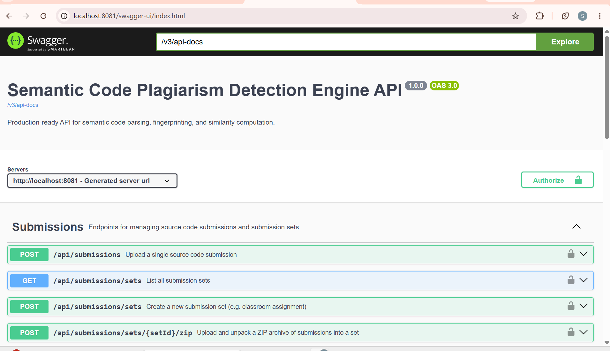
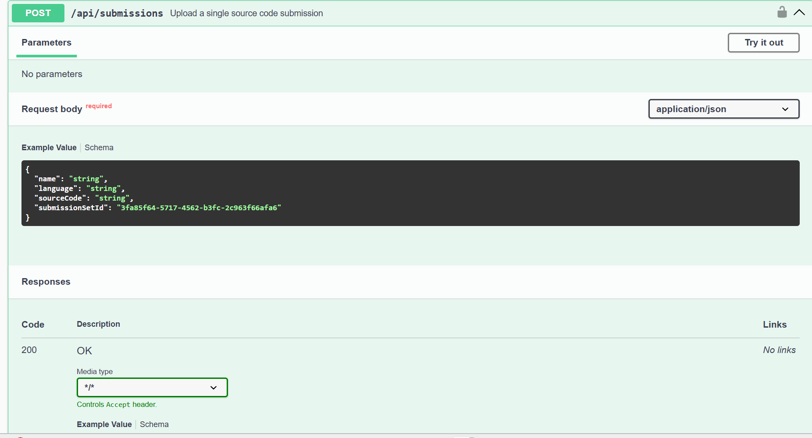
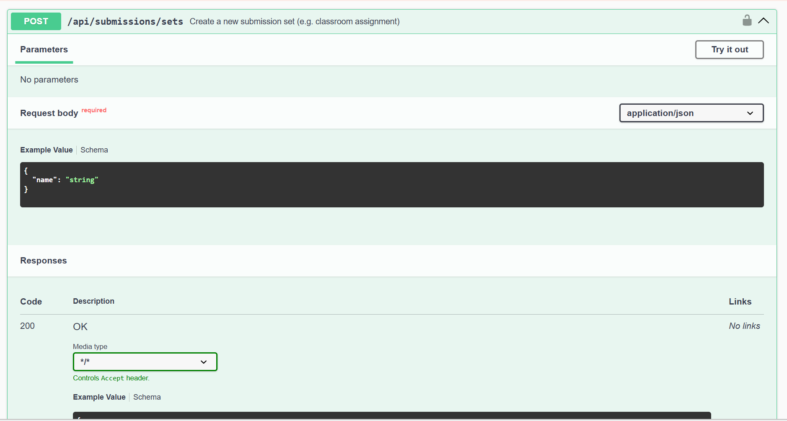
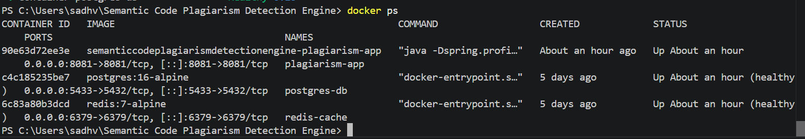

# Semantic Code Plagiarism Detection Engine

<p align="center">


</p>

<p align="center">
A production-ready semantic plagiarism detection platform that detects structural similarities across <b>Java</b>, <b>Python</b>, and <b>C++</b> source code using Abstract Syntax Trees (AST), fingerprinting algorithms, and multiple similarity metrics.
</p>

---

# Semantic Code Plagiarism Detection Engine

Traditional plagiarism checkers rely on textual comparisons, making them vulnerable to simple modifications such as variable renaming, formatting changes, comment removal, and function reordering.

The **Semantic Code Plagiarism Detection Engine** overcomes these limitations by analyzing the underlying program structure rather than raw source code. Each submission is normalized into a canonical representation, fingerprints are generated, and multiple similarity algorithms are combined to produce a weighted plagiarism score.

The system is designed using a modular Spring Boot architecture with secure REST APIs, PostgreSQL persistence, Redis-based fingerprint caching, Flyway database migrations, and Docker deployment. Its parser-driven design allows support for multiple programming languages while remaining extensible for future language integrations.

---

# Why Semantic Detection?

Unlike conventional code comparison tools, semantic analysis focuses on **program behaviour and structure** instead of formatting.

For example, the following two programs perform the same operation but look different textually.

**Original**

```java
int sum(int a, int b){
    return a + b;
}
```

**Modified**

```java
int addNumbers(int x, int y){
    return x + y;
}
```

Although the identifiers have changed, both programs produce the same Abstract Syntax Tree structure after normalization.

The engine therefore recognizes these submissions as highly similar even when superficial modifications are applied.

---

# Key Features

## Multi-Language Parsing

- Java source parsing using JavaParser
- Python parser module
- C++ parser module
- Extensible parser architecture through a parser factory

---

## Semantic Normalization

Before comparison, every submission undergoes normalization to remove irrelevant differences.

Normalization includes:

- Removal of comments
- Removal of whitespace differences
- Identifier normalization
- Canonical token generation
- Structural AST representation

---

## Multiple Similarity Algorithms

Instead of relying on a single comparison strategy, the engine combines multiple algorithms to improve detection accuracy.

| Algorithm | Purpose |
|-----------|---------|
| **AST Normalization** | Eliminates superficial code changes |
| **Winnowing Fingerprinting** | Detects copied fragments using rolling hashes |
| **Cosine Similarity** | Measures token frequency similarity |
| **Longest Common Subsequence (LCS)** | Detects structural sequence similarity |
| **Weighted Aggregation** | Produces the final plagiarism score |

---

## Secure REST APIs

The application exposes RESTful APIs protected using API-key based authentication through Spring Security.

Supported operations include:

- Assignment management
- Submission upload
- Bulk comparison
- Similarity report generation
- Result retrieval

---

## Enterprise-Oriented Design

The system is designed for handling large batches of submissions efficiently.

Key architectural capabilities include:

- Layered Spring Boot architecture
- Redis fingerprint caching
- Asynchronous processing
- Database-backed persistence
- Containerized deployment
- Swagger/OpenAPI documentation

---

# System Architecture

```text
                        Client Applications
                    (Browser / Postman / Scripts)
                                │
                                ▼
                     Spring Boot REST API (8081)
                                │
                    API-Key Authentication Filter
                                │
                                ▼
                    REST Controller Layer
        ┌──────────────┬──────────────┬──────────────┐
        │              │              │
        ▼              ▼              ▼
 Assignment      Submission      Comparison
 Controller       Controller      Controller
        │              │              │
        └──────────────┴──────────────┘
                       │
                       ▼
                Service Layer
                       │
        ┌──────────────┼──────────────────────┐
        │              │                      │
        ▼              ▼                      ▼
 Parser Factory   Similarity Engine      Repository Layer
        │              │                      │
        ▼              │                      ▼
 Java Parser           │                 PostgreSQL
 Python Parser         Redis
 C++ Parser         Fingerprint Cache
        │              │
        └──────────────┴──────────────┐
                                      ▼
                         Similarity Algorithms
                    ┌──────────┬──────────┬──────────┐
                    │          │          │
                    ▼          ▼          ▼
               AST Analysis Winnowing   Cosine
                               │
                               ▼
                     Longest Common Subsequence
                               │
                               ▼
                     Weighted Similarity Score
                               │
                               ▼
                     Plagiarism Detection Report
```

---

# Detection Pipeline

```text
Source Code Submission
          │
          ▼
Language Detection
          │
          ▼
Parser Factory
          │
          ▼
Language Parser
(Java / Python / C++)
          │
          ▼
AST Generation
          │
          ▼
Code Normalization
          │
          ▼
Canonical Token Stream
          │
          ▼
Fingerprint Generation
          │
          ▼
Similarity Analysis
 ├── AST Matching
 ├── Winnowing
 ├── Cosine Similarity
 └── LCS
          │
          ▼
Weighted Score Calculation
          │
          ▼
Plagiarism Report Generation
          │
          ▼
Database Storage & Result Retrieval
```

---

# Technology Stack

| Category | Technology |
|-----------|------------|
| Language | Java 21 |
| Framework | Spring Boot 3.2.x |
| Build Tool | Maven |
| Security | Spring Security |
| Database | PostgreSQL |
| Cache | Redis |
| ORM | Spring Data JPA |
| Database Migration | Flyway |
| Parser | JavaParser |
| Mapping | MapStruct |
| Boilerplate Reduction | Lombok |
| API Documentation | Swagger / OpenAPI |
| Testing | JUnit 5, Mockito, Testcontainers |
| Containerization | Docker & Docker Compose |

---

# Project Highlights

- Semantic plagiarism detection
- Multi-language parser architecture
- AST-based normalization
- Multiple similarity algorithms
- Redis fingerprint caching
- Secure REST APIs
- PostgreSQL persistence
- Dockerized deployment
- Flyway database migrations
- Swagger API documentation
- Modular layered architecture
- Extensible parser framework

---

## Table of Contents

- Project Overview
- Key Features
- System Architecture
- Detection Pipeline
- Technology Stack
- Project Structure
- Similarity Algorithms
- REST API
- Database Design
- Security
- Docker Deployment
- Local Development
- Testing
- Sample Results
- Screenshots
- Future Enhancements
- License

---
# Project Structure

```
Semantic-Code-Plagiarism-Detection-Engine
│
├── src
│   ├── main
│   │   ├── java
│   │   │   └── ...project package...
│   │   │       ├── config/
│   │   │       ├── controller/
│   │   │       ├── entity/
│   │   │       ├── parser/
│   │   │       ├── repository/
│   │   │       ├── security/
│   │   │       ├── service/
│   │   │       ├── similarity/
│   │   │       ├── dto/
│   │   │       ├── mapper/
│   │   │       └── util/
│   │   │
│   │   └── resources
│   │       ├── application.yml
│   │       └── db/
│   │           └── migration/
│   │
│   └── test/
│
├── sample-data/
│   └── seed_data.py
│
├── docker-compose.yml
├── Dockerfile
├── pom.xml
├── API.md
└── README.md
```

---

# Layered Architecture

The application follows a clean layered architecture that separates responsibilities into independent modules for maintainability and scalability.

| Layer | Responsibility |
|--------|----------------|
| Controller | REST endpoints and request handling |
| Service | Business logic and orchestration |
| Parser | Language-specific parsing and normalization |
| Similarity | Similarity calculation algorithms |
| Repository | Database access using Spring Data JPA |
| Entity | Database models |
| Security | API-key authentication and request filtering |
| Config | Spring Boot, Redis, Async, and Flyway configuration |

---

# Core Components

## Parser Module

The parser layer converts uploaded source code into a normalized representation suitable for semantic comparison.

Supported parser implementations include:

- Java Parser
- Python Parser
- C++ Parser

A parser factory selects the appropriate parser implementation based on the submitted language, making it straightforward to add support for additional languages.

---

## Similarity Engine

The similarity engine combines multiple algorithms to generate a robust plagiarism score.

Instead of depending on one comparison technique, several independent scores are calculated and aggregated.

### AST Normalization

The parser transforms source code into a canonical representation by removing non-semantic differences such as:

- Comments
- Formatting
- Variable names
- Function names
- Whitespace

This allows structurally equivalent programs to be recognized even after superficial modifications.

---

### Winnowing Fingerprinting

Winnowing generates compact fingerprints using rolling hashes and sliding windows.

Benefits:

- Detects copied code fragments
- Resistant to small edits
- Efficient for large submissions
- Widely used in plagiarism detection systems

---

### Cosine Similarity

Cosine similarity compares token frequency vectors generated from normalized code.

It helps detect:

- Similar coding patterns
- Shared structural vocabulary
- Partially copied implementations

---

### Longest Common Subsequence (LCS)

LCS measures the longest matching sequence between normalized token streams.

Advantages include:

- Structural comparison
- Order-sensitive matching
- Detection of partially rearranged code

---

### Weighted Similarity Score

The final plagiarism percentage is computed by combining the outputs of all similarity algorithms.

This multi-algorithm strategy reduces false positives and improves detection accuracy.

---

# Database Design

The application stores plagiarism data in PostgreSQL using Spring Data JPA.

Persistent information includes:

- Assignment information
- Source code submissions
- Fingerprints
- Comparison results
- Audit records

Flyway is used to manage schema migrations and version database changes consistently across environments.

---

# Redis Caching

Redis is used to cache computationally expensive fingerprint data.

Benefits include:

- Faster repeated comparisons
- Reduced parser overhead
- Lower database load
- Improved throughput during bulk analysis

---

# Security

The application secures protected endpoints using Spring Security with stateless API-key authentication.

Every protected request must include an API key in the request header.

```
X-API-KEY: reviewer-secret-key-67890
```

or

```
X-API-KEY: admin-secret-key-12345
```

This approach keeps the API lightweight while restricting unauthorized access.

---

# REST API

The project exposes RESTful APIs for managing assignments, submissions, and plagiarism analysis.

## Assignment Management

| Method | Description |
|----------|-------------|
| POST | Create Assignment |
| GET | Retrieve Assignments |
| DELETE | Remove Assignment |

---

## Submission Management

| Method | Description |
|----------|-------------|
| POST | Upload Source Code |
| GET | View Submission |
| DELETE | Delete Submission |

---

## Similarity Analysis

| Method | Description |
|----------|-------------|
| POST | Start Comparison |
| GET | Retrieve Comparison Results |
| GET | View Similarity Report |

> Complete request and response formats are available in **API.md**.

---

# API Documentation

After starting the application, interactive API documentation is available through Swagger.

```
http://localhost:8081/swagger-ui.html
```

The documentation includes:

- Endpoint descriptions
- Request payloads
- Response schemas
- Authentication requirements

---

# Processing Workflow

```
Client Request
      │
      ▼
API Authentication
      │
      ▼
REST Controller
      │
      ▼
Business Service
      │
      ▼
Parser Factory
      │
      ▼
Language Parser
      │
      ▼
AST Normalization
      │
      ▼
Fingerprint Generation
      │
      ▼
Similarity Algorithms
      │
      ▼
Weighted Score
      │
      ▼
Redis Cache
      │
      ▼
PostgreSQL Storage
      │
      ▼
Similarity Report
```

---

# Design Principles

The project has been designed around several software engineering principles:

- Clean separation of concerns
- Modular parser architecture
- Extensible similarity engine
- Stateless REST APIs
- Secure authentication
- Database migration support
- Container-first deployment
- Maintainable layered architecture

---
# Docker Deployment

The project is fully containerized using Docker and Docker Compose, allowing the complete application stack to be deployed with a single command.

## Build and Start Services

```bash
docker-compose up --build
```

This starts the following services:

- Spring Boot Application
- PostgreSQL Database
- Redis Cache

---

## Service Ports

| Service | Port |
|----------|------|
| Spring Boot API | 8081 |
| PostgreSQL | 5433 |
| Redis | 6379 |
| Swagger UI | http://localhost:8081/swagger-ui.html |

---

# Local Development

## Clone the Repository

```bash
git clone https://github.com/SadhviRachamalla/Semantic-Code-Plagiarism-Detection-Engine.git

cd Semantic-Code-Plagiarism-Detection-Engine
```

---

## Start Required Services

```bash
docker-compose up -d postgres-db redis-cache
```

---

## Build the Project

```bash
mvn clean install
```

---

## Run the Application

```bash
mvn spring-boot:run
```

The application will be available at:

```
http://localhost:8081
```

---

# Database Migration

Flyway automatically manages database schema versioning during application startup.

Migration scripts are located in:

```
src/main/resources/db/migration
```

This ensures every environment uses the same database schema without manual SQL execution.

---

# Testing

The project includes automated unit and integration tests using:

- JUnit 5
- Mockito
- Testcontainers

Run all tests using:

```bash
mvn test
```

---

# Sample Dataset

A sample script is provided for demonstrating the plagiarism detection workflow.

Execute:

```bash
python sample-data/seed_data.py
```

The script automatically:

- Creates assignment data
- Uploads sample source files
- Executes plagiarism comparison
- Generates similarity reports

---

# Example Similarity Report

| Submission | Compared With | Similarity |
|------------|---------------|-----------:|
| Student A | Student B | 94.8% |
| Student A | Student C | 87.2% |
| Student D | Student E | 19.4% |
| Student F | Student G | 96.1% |

> **Note:** These values are illustrative. Actual similarity scores depend on the uploaded source code.

---

## 📸 Screenshots

### Swagger UI


### Upload Submission API


### Create Submission Set API


### Docker Containers


---

# Future Enhancements

Potential improvements include:

- JavaScript parser support
- Go and Rust language support
- Machine learning-assisted plagiarism scoring
- Interactive instructor dashboard
- PDF report generation
- Git repository comparison
- Visual similarity graphs
- Batch upload interface
- CI/CD deployment pipeline

---

# Author

**Sadhvi Rachamalla**

GitHub:

https://github.com/SadhviRachamalla


